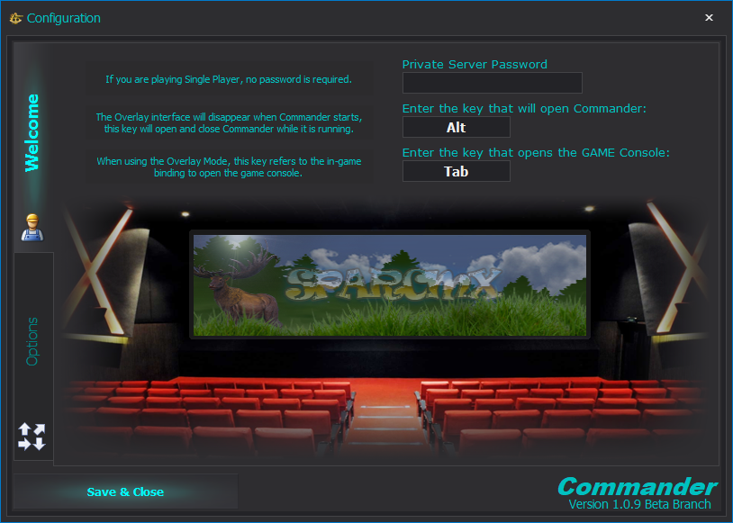
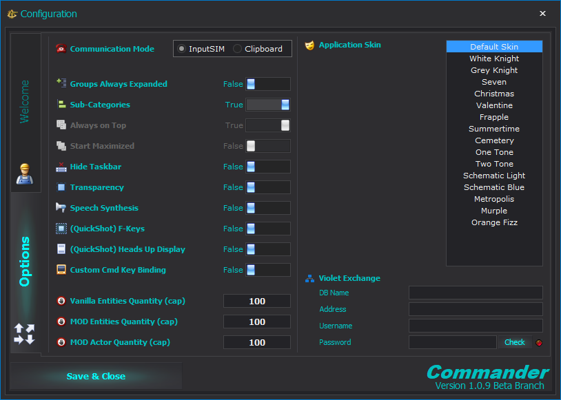
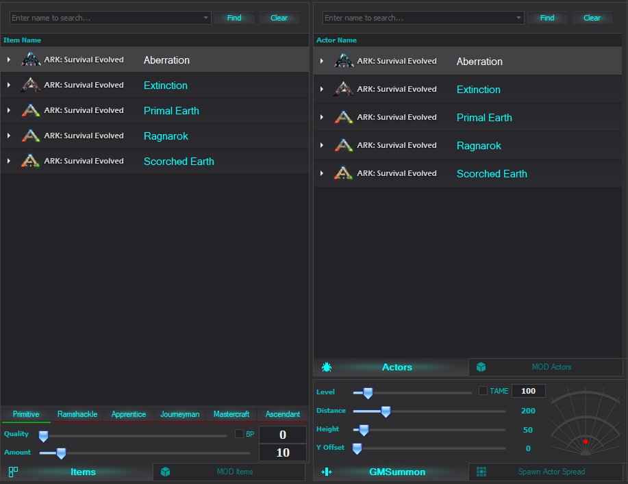
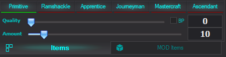
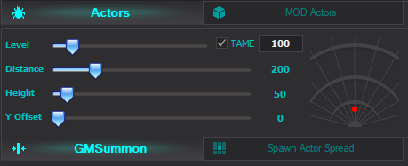

## Installation
## Configuration
On first startup you will you need to select the game and interface mode you prefer to use Commander in.
### Gameselection

Select the game you want to use Commander for by clicking on it.
### Interface Style

Select your prefered Interface style.

Windowed-Mode gives you a freely movable window with the essential features of Commander.
It is missing the [Mapping](#Mapping_GUI) feature 

Overlay-Mode has all features of Commander and is recommended to use.
### Options
Additional Options can be found when clicking on the :gear: icon in the top left 

the "Welcome" page features options to specifiy a server password and the keybindings to open the ingame console as well as Commander when in Overlay-Mode

it also has the credits in a nice animation on it

the "Options" page features more ways of customisation

# Main GUI
## Overview

## Item Spawn Lists
The Item Spawn Lists contain 2 sections

On the left side you can find a list of all items known to Commander and on the right all Creatures 
> in Windowed-Mode only one of those lists shows and the other will be an other tab on top 
{.is-info}

>To spawn an item simply double left click on it and the command will either be send to your clipboard or directly into ark (depending on what input method you selected)
{.is-success}

below the lists are additional options to modify the items/creatures listed above
### Item Spawn List options

The top row shows the cuurent quality a item will be spawned with  
you can click on the quality you wish to spawn or finetune the exact quality number with the slider below

the "Amount" slider is to fine tune how many items will be spawned at once useing double right click

selecting the "BP" box simply spawns a Blueprint of the item with the specified options

you can also change to MOD Items on the tab below 
>Please note that you need to select the MOD you want to use first in the [MOD HIVE](#MOD_HIVE)
{.is-warning}

### Actor/Creature Spawn List options

the top tab lets you switch between default and MOD creatures
>Please note that you need to select the MOD you want to use first in the [MOD HIVE](#MOD_HIVE)
{.is-warning}

There are 2 different ways to spawn creature using Commander 
#### GMSummon
this command lets you specify the level and if you want a tamed creature to spawn
the following options are available 
**Level:** adjust the level of the spawned creature 
>NOTE: if you tick the "TAME" box ark will add half of the level selected on top of the spawned creature 
{.is-info}

**Distance:**  adjust how far in front of you the dino will be spawned  
**Height:** adjust how high above you the dino will be spawned  
**Y Offset:**  adjust this to let a dino spawn more to the left or right of you 
>NOTE:  all units are UE4 units for comparison a foundation is 300x300 units 
{.is-info}

#### Spawn Actor Spread
this command spawns multiple random leveled **wild** creatures in a specified area 

**Amount:** specifies how many creatures should be spawned  
**Distance:** specifies how far in front of you the center of the area, creatures spawn in, will be  
**Height:** specifies how high above you the center of the area, creatures spawn in, will be  
**Y Offset:** specifies how far right / left the center of the area, creatures spawn in, will be  
**Spread:** speciies how big the area, creatures spawn in, will be

>NOTE:  all units are UE4 units for comparison a foundation is 300x300 units 
{.is-info}
## MOD HIVE

## Command Panel
## Finger Cannon
## Redirected Spawning
## Custom Commands
## F-Key Quickshots
# Mapping GUI
## Overview
## Teleporting
## Bookmarks
## Loading Savefile data
## Loading Violet data
